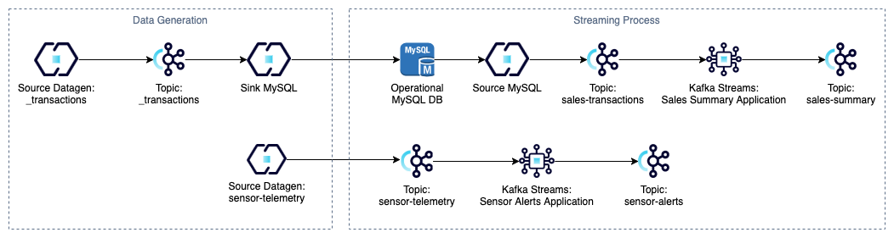

# Kafka Streams Project: Farmia Case Study

## Overview
The goal of this project is to build a Kafka cluster capable of simulating a real-time data stream. The cluster consists
of:

- **3 brokers** and **3 controllers**
- **Schema registry**
- **4 connectors**
- **2 Kafka Streams applications**
- **1 relational database**

## Background
This project simulates a real-world streaming use case for a fictitious company called **Farmia**, which specializes in
selling agricultural products.

Farmia operates a relational database that records sales transactions. Additionally, the company uses an IoT system to 
monitor production processes through a network of sensors that continuously send telemetry data.

## Applications
This project includes two Kafka Streams applications designed to process real-time data from sales and sensor telemetry.

### 1. `sales-transactions-summary-app`
This application summarizes sales transactions by aggregating data by category within **1-minute windows**.

**Output fields:**
- **Category** – Product category
- **Total quantity sold** – Total number of units sold
- **Total revenue received** – Total sales revenue
- **Window start timestamp** – Start time of the aggregation window
- **Window end timestamp** – End time of the aggregation window

**Example output:**
```json
{
  "category": "pesticides",
  "total_quantity": 31,
  "total_revenue": 272.54,
  "window_start": 1741505220000,
  "window_end": 1741505280000
}
```

**How it works:**
- The application reads data from the `sales-transactions` topic, populated by a source connector that pulls data from 
the relational database.
- The aggregated results are written to the `sales-summary` topic.

### 2. `sensors-alerts-app`

This application generates alerts when specific conditions are met:
- Temperature exceeds 35°C
- Humidity falls below 20%

**Example output:**
```json
{
  "sensor_id": "sensor_991",
  "alert_type": "LOW_HUMIDITY",
  "timestamp": 1741421301,
  "details": "Humidity is below 20.0%"
}
```

**How it works:**
- The application reads data from the `sensor-telemetry` topic, which receives real-time data from production system 
sensors.
- Alerts are written to the `sensor-alerts` topic.

### Configuration

Both applications were developed in **Scala**. The configuration settings, such as the aggregation window and alert 
thresholds, can be adjusted through environment variables in the **Docker Compose** file.

**Modifiable Settings:**
- **Aggregation window** – Defined in **minutes** and must be greater than 0.
- **Temperature threshold** – Must be greater than 0.
- **Humidity threshold** – Must be between 0 and 1 (representing a percentage).

**How to Modify Settings:**

To adjust these values:
1.	Open the Docker Compose file.
2.	Edit the relevant environment variables.
3.	Rebuild the compose using `docker compose build` command.

## Architecture

Below is an illustration of the project workflow. The resources in the `Data Generation` group are used to generate 
simulated data, while the resources in the `Streaming Process` group handle real-time data processing.



To simulate a real-world scenario and create interactivity in the transactions table located in the database, a couple
of connectors are used to continuously load data into it. For this, **_transactions** topic is used.

- **source-datagen-_transactions:** Generates transactions that comply the defined schema.
- **sink-mysql-_transactions:** Writes the transactions in a table of the database.
- **source-mysql-transactions:** Writes the transactions from the operational database to a Kafka topic.
- **source-datagen-sensor-telemetry:**: Generates telemetry that comply the defined schema.

## Organization

The project is organized in the following directories:

- **datagen**: Contains the schemas of the two datasets of Farmia sources (*.avsc)
- **connectors**: Contains the configuration files of the connectors (*.json)
- **docker**: Contains the Docker Compose configuration, which sets up a local cluster environment. 
It also includes Dockerfiles that enable the deployment of applications within the cluster.
- **sensors-alerts-app**: Contains the source code of the application.
- **summary-transactions-app**: Contains the source code of the application.

# Tasks description

I decided not to modify the base of the project (the initial schemas and data configurations) provided by the teacher to
make the scenario more realistic. This reflects real-world situations where we often cannot alter the data structures 
provided by the client. Therefore, all my transformations and processing are performed within the sections I developed.

## Task 1: Integration of MySQL with Kafka Connect

This is the connector I configured:

```avroschema
{
   "name": "mysql-source-connector",
   "config": {
      "connector.class": "io.confluent.connect.jdbc.JdbcSourceConnector",
      "connection.url": "jdbc:mysql://mysql:3306/db?user=user&password=password&useSSL=false",
      "mode": "timestamp",
      "table.whitelist": "sales_transactions",
      "timestamp.column.name": "timestamp",
      "poll.interval.ms": "1000",
      "tasks.max": "1",

      "key.converter": "org.apache.kafka.connect.storage.StringConverter",
      "value.converter": "io.confluent.connect.avro.AvroConverter",
      "value.converter.schema.registry.url": "http://schema-registry:8081",

      "transforms": "CastPrice, RenameTopic, SetSchemaNamespace, SetKey, ExtractKey",

      "transforms.CastPrice.type": "org.apache.kafka.connect.transforms.Cast$Value",
      "transforms.CastPrice.spec": "price:float64",

      "transforms.RenameTopic.type": "org.apache.kafka.connect.transforms.RegexRouter",
      "transforms.RenameTopic.regex": "sales_transactions",
      "transforms.RenameTopic.replacement": "sales-transactions",

      "transforms.SetSchemaNamespace.type": "org.apache.kafka.connect.transforms.SetSchemaMetadata$Value",
      "transforms.SetSchemaNamespace.schema.name": "com.farmia.sales.sales_transactions",

      "transforms.SetKey.type": "org.apache.kafka.connect.transforms.ValueToKey",
      "transforms.SetKey.fields": "category",

      "transforms.ExtractKey.type": "org.apache.kafka.connect.transforms.ExtractField$Key",
      "transforms.ExtractKey.field": "category"
   }
}
```

### Process Explanation

- The connector will track the records it has already processed using the `timestamp` column defined in the table from 
which the records are being read. This approach was chosen because there is no auto-incremental column available, which
would have made the process more robust by allowing the use of a `timestamp+incremental` mode.
- The connector will poll the database every 1 second.
- I applied a cast transformation because the `price` column was causing issues. The `DOUBLE` type in SQL appears to 
behave differently, so I cast it to `float64` to ensure it could be processed correctly.
- I also implemented a topic renaming transformation to ensure records are written to the correct topic. The connector 
was reading from a table called `sales_transactions` and attempting to route the records to a topic with the same name. 
Since this topic did not exist, the connector was creating it, which is incorrect behavior. The renaming ensures that 
the records are written to the correct topic (`sales-transactions`).
- To automatically generate the SerDes classes for the Kafka stream that will process these records, I needed to define 
a namespace in the Avro schema. Initially, the connector was generating and registering a schema without a namespace in
the schema registry, causing the generated classes to mismatch the published schema. This mismatch in the schema 
registry caused my application to fail because it didn’t match the schema being written. Adding the namespace resolved 
this issue and ensured the schema was correctly mapped.
- The last two transformations allow setting the value of the category field as the key. This helps route records 
related to the same category to the same partition, and makes the aggregation easier since I used a group-by-key 
operation.

## Task 2: Synthetic data generation using Kafka Connect

### Process Explanation
- Based on the experience got from the previous task, I defined a namespace.
- Using a regex I defined the sensor ID.
- Temperature values are between `15.00` and `50.00`.
- Humidity values are between `0.05` and `0.7`.
- Soil Fertility values are between `40.00` and `90.00`.
- The timestamp starts at 1741421258 (Saturday, March 8, 2025, 9:07:38) and increments by 1 second. I configured it this
way because it was previously generating negative timestamps.

## Task 3: Real-time processing with Kafka Streams. Sensor alerts app

### Configuration Object
Before developing the application, I designed a configuration object to map environment variables and assign default 
values when they are not defined. Additionally, I aimed to make certain parameters, such as the temperature and humidity
thresholds, configurable by the user. To achieve this, I created a `ConfigReader` trait that defines an interface for 
reading configuration values from the `application.conf` file. The read function in the trait takes two parameters: a 
`Config` object and a `path` to the requested parameter. The `ConfigReader` companion object implements the behavior of 
the read function based on the type of value being retrieved. It provides implicit readers for common types such as 
`String`, `Int`, and `Double`, ensuring that the configuration values are correctly parsed and validated at runtime.

The `ConfigReader` object is used in the `getOrDefault` function to retrieve the value of a configuration parameter. If 
the parameter is not defined, the function returns a default value. The function takes a `path` to the configuration key
and a default value. It uses an implicit `ConfigReader` to read the value from the configuration. If reading the value 
fails (due to a missing or invalid configuration), the function catches the exception and returns the default value,
ensuring the application can continue running with a fallback configuration.

### Specific Avro Classes generation

After that, I defined the AVRO schemas, which, with the help of a plugin, allowed me to automatically generate the 
classes needed to serialize and deserialize messages using a `SpecificAvroSerde`. The schemas define the namespace, the 
schema name, and the corresponding fields, specifying both the field names and types. By running the `mvn clean compile` 
command, the classes were automatically generated in the path I configured in the plugin settings. A package with the 
defined namespace was created, making it available for import in my application. Initially, I attempted to set this up 
using SBT, but I encountered issues with the plugin. Consequently, I decided to switch to Maven, and fortunately, 
everything worked smoothly. I plan to continue using Maven for my future Scala projects.

### Initialization and configuration

Regarding the application, the first step is to define the necessary stream properties, such as the bootstrap servers 
configuration, the default key and value SerDes, and other essential Kafka settings. These properties are defined using 
the `defineStreamConfig()` function, which ensures that the Kafka Streams instance is correctly configured to connect to 
the Kafka cluster and the schema registry.

Next, the threshold values for temperature and humidity are retrieved from the configuration using 
`SensorsAlertsConfig`. This allows the application to adjust to different environmental conditions without requiring 
code changes. After that, the specific Avro SerDes are created using the previously generated classes. This is handled 
by the `createAvroSerde` function, which configures the SerDes to work with the schema registry, enabling the 
serialization and deserialization of Avro messages.

Once the SerDes are set up, the sensor stream is defined using the `StreamsBuilder` class. The stream reads sensor 
telemetry data from the input topic specified in the configuration. The data is deserialized using the 
`SpecificAvroSerde`for `SensorTelemetry`.

### Filter step

The application then applies filters to identify sensors exhibiting unexpected behavior:
- **Temperature alerts** – The stream filters out records where the temperature exceeds the defined threshold. The 
`createAlert` function is used to transform these records into alert messages.
- **Humidity alerts** – Similarly, the stream filters out records where the humidity drops below the defined threshold and 
generates an alert using the same transformation function.

### Output and Stream lifecycle

The resulting alert messages has the sensor ID as a key and are sent to the output topic defined in the configuration. 
The messages are serialized using the `SpecificAvroSerde` for `SensorAlerts`.

Finally, a `KafkaStreams` instance is created with the defined stream configuration and started. A shutdown hook is also 
added to ensure that the stream is closed gracefully when the application is terminated.

## Task 4: Real-time processing with Kafka Streams. Sales summary app

This application also uses a configuration object that works similarly to the one described earlier.

### Initialization and Configuration

The first steps of the application are analogous to the previous one, with the key difference being that the schemas are
different. However, they are generated in the same way using the same plugin. The window size, which defines the time 
frame for aggregating records, is also obtained from the configuration.

Once the configuration is properly set, the application groups the messages by key. The key, which corresponds to the 
`category`, is structured using the source JDBC connector. This allows the application to aggregate sales data by 
`category` within the defined window size.

### Aggregation Setup

To set up the windowed stream, three key components are defined:
1. `salesSummaryInitializer` – This defines how to initialize the aggregation state for each window. It creates an 
instance of the `sales_summary` class, which defines the schema for writing results to the output topic each time a new 
window starts.
2. `salesSummaryAggregator` – This defines how each variable of the initialized class will evolve when a new record 
enters the window. A record enters the window when the key matches the group currently being processed. Specifically:

   - The `category` is retained. 
   - The `totalQuantity` is incremented by the quantity in the new record. 
   - The `totalRevenue` is incremented by the price in the new record. 
   - The window start and end times are assigned based on the window’s time boundaries.

3. `materialized` – This defines how to persist the aggregated records. It creates a persistent window store using the 
defined window size and configures the key and value SerDes.

### Windowed Stream Processing

The `groupedStream` groups records by key (`category`) and applies the windowing strategy using the windowedBy method. The
window size is set to one minute, and the aggregate function is used to combine the records according to the logic 
defined in the `salesSummaryAggregator`.

The resulting `windowedStream` is a `KTable` that holds the aggregated sales data for each window and key combination.

### Mapping and Output

The `mapWindowedToSummary` function maps the Windowed key to a key value pair that consists of the key (`category`) and 
a `sales_summary` object, assigning the window’s start and end times to the corresponding fields in the summary object.

The Ktable is transformed to stream with the help of the `mapWindowedToSummary` function and is then written to the 
output topic specified in the configuration.

### Stream Lifecycle

A KafkaStreams instance is created with the defined stream configuration, and the stream processing is started. A 
shutdown hook is also added to ensure that the stream is properly closed when the application is terminated.

## Build Applications

The following script automates the applications building process.

1. Compiles and packages the apps.
2. Copy the generated `.jar` files to the `docker/apps` folder to build the corresponding images.
3. Build the docker compose.

```shell
./build_apps.sh
```

> ⚠️ **NOTE**<br/>If you have a permission access problems when running the file (`zsh: permission denied: 
> ./build_apps.sh`) just execute `chmod +x build_apps.sh` and try again.

## Setup

The following script automates the necessary steps to prepare the environment.

1. Starts the environment.
2. Creates the topics in the cluster.
3. Creates the transactions table in MySQL database.
4. Installs the plugins of the connectors.
5. Copy the drivers JDBC for MySQL.
6. Copy the AVRO schemas inside the connect container.
7. **Starts the Kafka Streams applications.**

```shell
./setup.sh
```

## Kafka Connect

The following script automates the connectors execution.

```shell
./start_connectors.sh
```

## Kafka Streams

The automation of the applications execution is made in the setup step.

## Shutdown

The following command shuts down the environment.

```shell
./shutdown.sh
```

> ⚠️ **NOTE**<br/>The state of the containers is not persisted. This means that the state and data in our cluster will be lost once we stop it.

## How to run the project?

1. Execute the build application
    ```shell
    ./build_apps.sh
    ```
2. Execute the setup
    ```shell
    ./setup.sh
    ```
3. Execute the connectors
    ```shell
    ./start_connectors.sh
    ```
4. Shut down the application when needed.
    ```shell
    ./shutdown.sh
    ```